```
 ████████╗  █████╗  ██████╗  ███████╗
 ╚══██╔══╝ ██╔══██╗ ██╔══██╗ ██╔════╝
    ██║    ███████║ ██║  ██║ █████╗
    ██║    ██╔══██║ ██║  ██║ ██╔══╝
    ██║    ██║  ██║ ██████╔╝ ███████╗
    ╚═╝    ╚═╝  ╚═╝ ╚═════╝  ╚══════╝
      ·  ·  ·   said, and done   ·  ·  ·
```

# Tade — **T**erminal **A**gentic **D**evelopment **E**nvironment

### Say what you want done. Watch a team of coding agents do it — in one terminal window.

Tade is an IDE for the agents doing the work: an orchestrator you talk to, agents in your own
repositories, a queue that knows what waits for what, and every file, diff, terminal and dollar in
front of you while it happens.



```sh
git clone <this repository> tade && cd tade
pnpm install
pnpm run link:global    # puts `tade` on your PATH
tade                    # the window; the first time, a short setup
```

Node ≥ 22.19, pnpm 10 and git. No build step — [full install and setup below](#install).

---

## The window

Agents down the left with what each has cost, their changes, the files, the agent you are watching
in the middle, the orchestrator along the bottom. One terminal, no browser, no daemon.

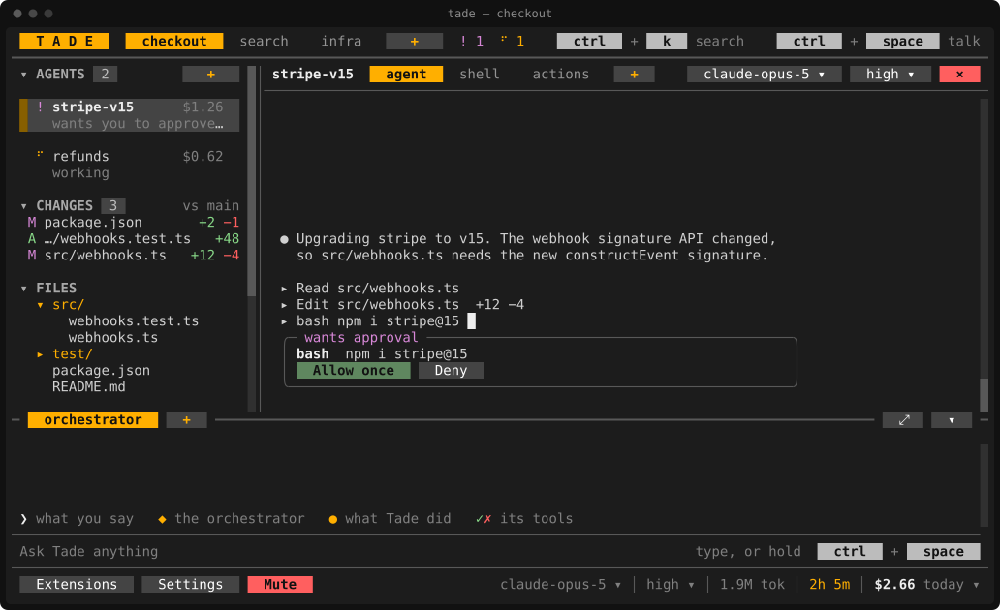

---

## An orchestrator you talk to

Say or type what you want. It starts, steers and stops agents, opens terminals and runs things in
them, and shows every tool as it runs — including the ones that fail, with the reason. Drop a
screenshot on the window and it goes with whatever you say next.

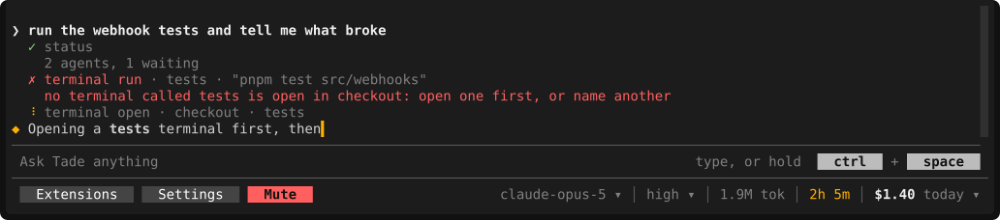

---

## Voice, first

Hold `ctrl+space` and talk. Speech stays on your machine by default (whisper.cpp), answers come back
as a few spoken sentences with the rest on screen, and mute is instant — it cuts the sentence being
said, not the next one.

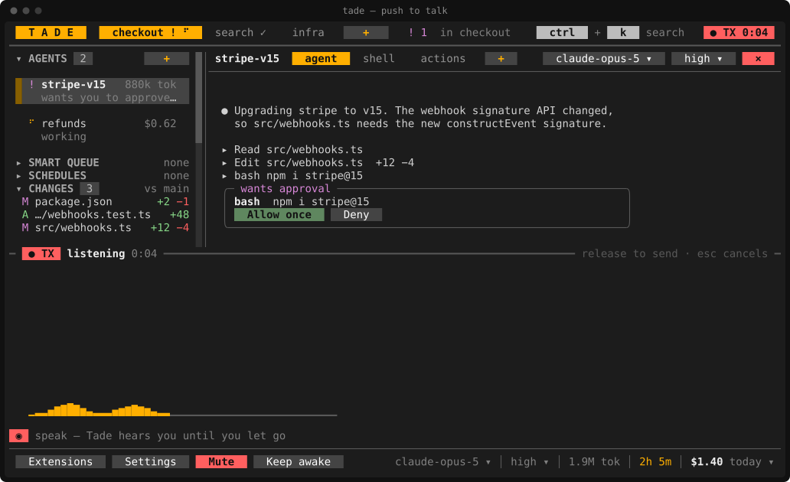

---

## Agents, together or apart

Every agent is [pi](https://github.com/earendil-works/pi) in a lane of its own. By default they all
work in the project's checkout on its branch; `agents.workspace: worktree` gives each a worktree and
branch instead. What each one *is* — working, idle, waiting on you, failed, finished — is derived
from git, processes and transcripts, never remembered.

<table>
<tr>
<td width="34%">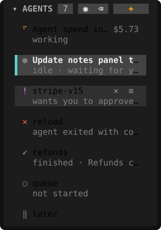</td>
<td width="66%">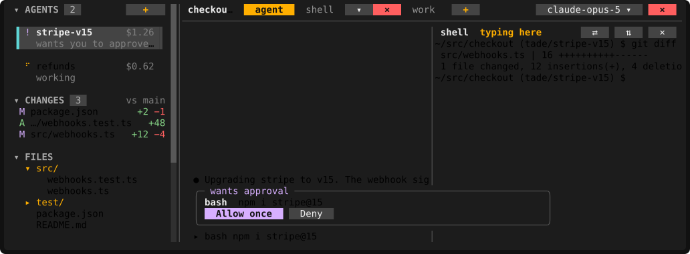</td>
</tr>
</table>

---

## Smart queues

Ask for five things at once. What can run now runs; the rest waits for exactly what it needs and
starts by itself. Click a piece of queued work and you see the whole chain, why each link waits, and
what its agent will be told — looking is never starting.

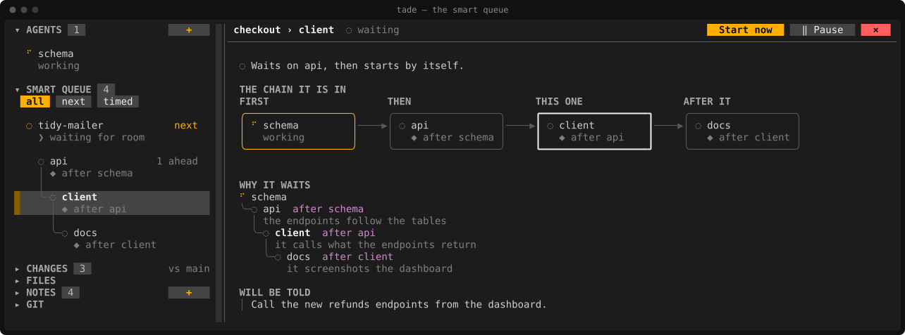

When something upstream fails, the work it feeds is **held**, not lost — and Tade says so and asks.

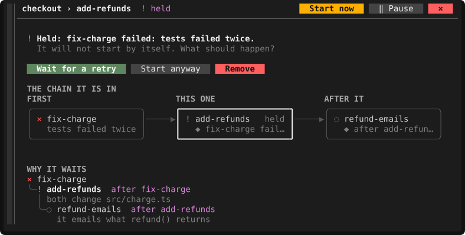

---

## Scheduled tasks

"Every Monday morning, update our dependencies." It becomes a schedule: a rule, an instruction, and
a record of every run. There is no daemon — what came due while Tade was closed is caught up once
when it opens, or skipped, as the schedule says.

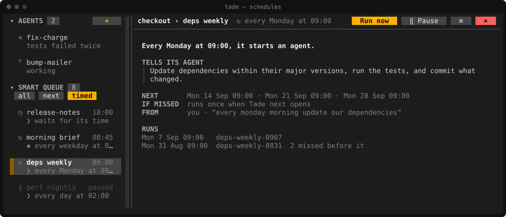

---

## Watches

A watch is a schedule that looks before it acts: a cheap check with no model, and an agent on each
new finding. Extensions offer them; nothing is watched until you turn one on.

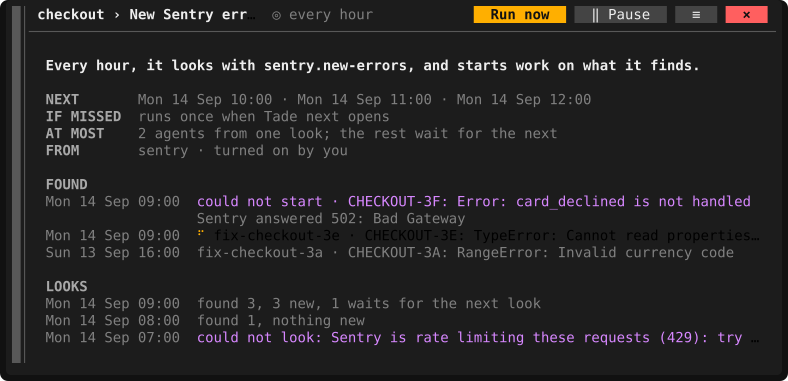

---

## An IDE in the terminal

The repository is right there while the agents work it: the file tree, the diffs, the branch, a
terminal in the same worktree — and a file you can open where you are, highlighted and numbered,
found in with `ctrl+f`, typed into and saved, or handed to the editor you actually use.

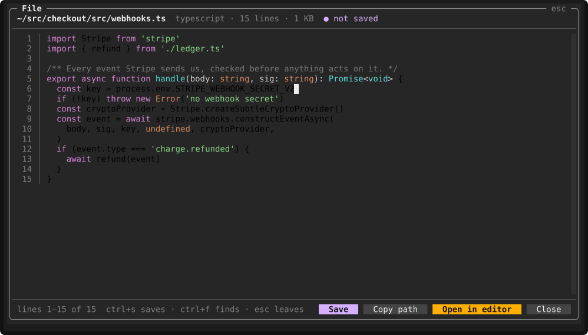

---

## Context-rich search

`ctrl+k` finds agents, files in every worktree, the lines inside them and the things Tade can do —
each result saying which project and which agent it belongs to. `file:42` goes straight to a line.

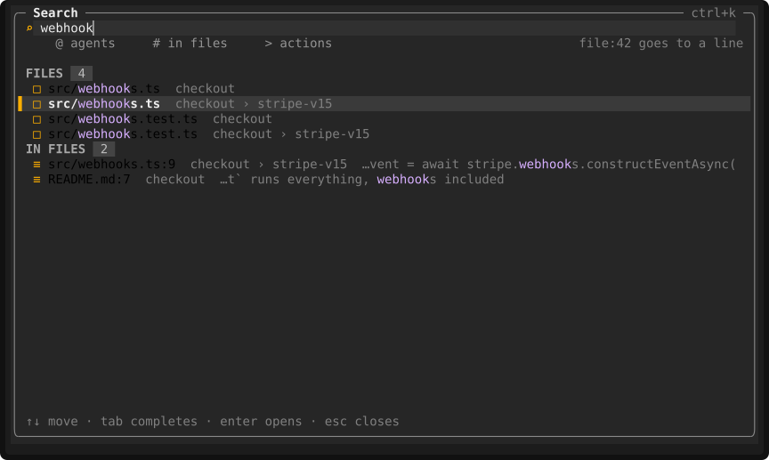

---

## Changes, tracked as they happen

Every file an agent touches, marked the way git marks it, with the diff a click away and the branch,
worktree and path it is all happening in.

<table>
<tr>
<td width="30%">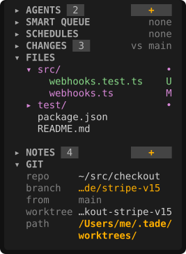</td>
<td width="70%">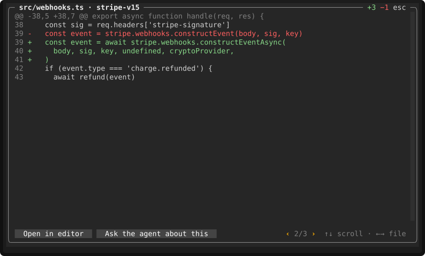</td>
</tr>
</table>

---

## The checks, before anybody else sees them

A project says what it checks in one file — `.tade/checks.yaml` — and the same file is what CI is
generated from, so "the same thing" is a fact rather than a hope. Tade runs them here, one set at a
time per checkout, and records each against the commit it ran on; a push with nothing green behind
it is held with what is missing, and an agent that is certain a failure is not its own overrules
that out loud, with a reason the person is told.

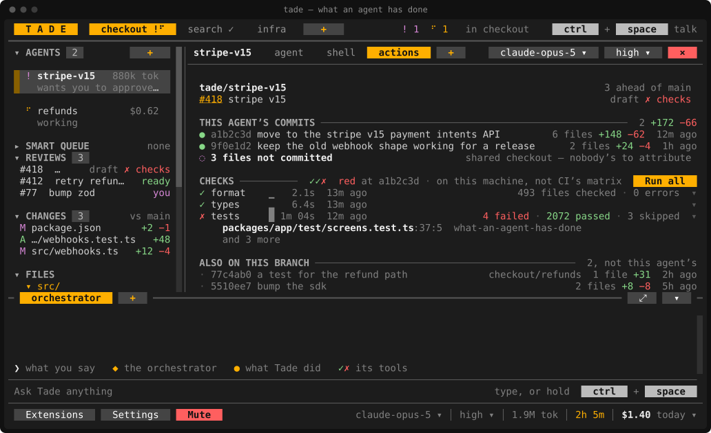

---

## Reviews, and the loop around them

What you have offered other people, and what they and their robots say about it: your open pull
requests, what waits on you, what CI makes of each, and the conversations nobody has answered.
Agents open reviews with a `Tade-Task:` trailer, so which work a commit belongs to stays readable
out of git forever. Watches can fix what is red and answer the bots — and nothing merges anything
unless you asked for exactly that.

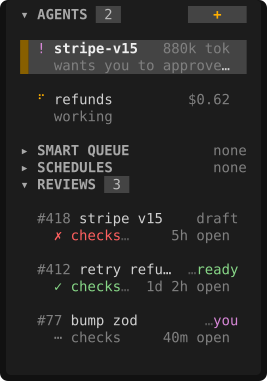

---

## Spend, time and tokens

What every agent and the orchestrator cost today, this window or this week — tokens, runtime and
dollars, each project against the budget you gave it. Runtime is derived from when agents started
and exited, so nothing holds a stopwatch.

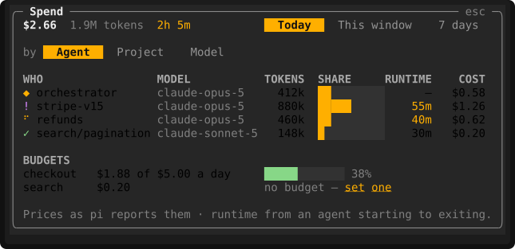

---

## Resources

Tade has to be light, and proves it: what it and everything it runs is using, in the status bar and
broken down by project, by kind and by agent.

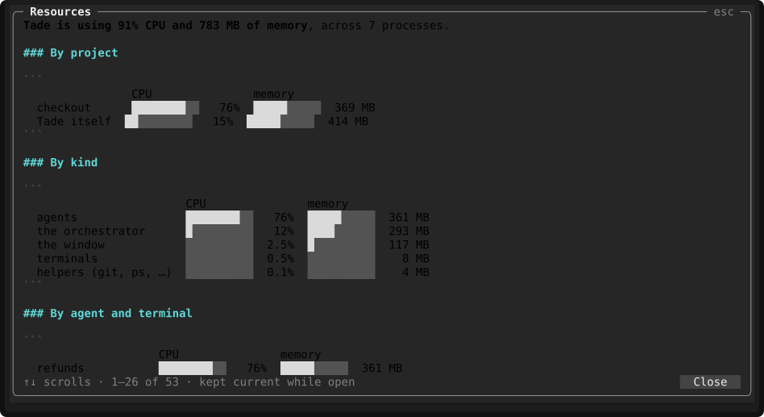

---

## Local memory and notes

Notes are the one thing Tade is told rather than derives, so they are kept word for word, in a file
you own. Say *"remember the staging key rotates on the 1st"*, or press `+`. Agents are given the
notes that concern their work.

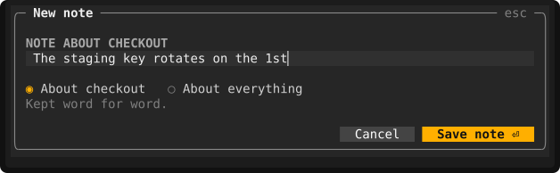

---

## Many projects, many tasks

Projects along the top, agents running in all of them at once. An agent in a project you are not
looking at can still reach you — and be answered from where you are.

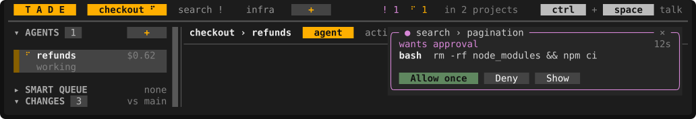

---

## Extensions

Checks, Dependencies, Jev, Reviews, Sentry and Resources ship with Tade; yours go beside them in
`~/.tade/extensions/<name>/extension.ts`. An extension brings tools the orchestrator and your agents
can both call, settings, and watches. Being there is not being on: an extension of yours is listed
and off until you turn it on, here or with `tade extensions enable`, and it loads the next time Tade
starts. Tade writes tools for itself into the same folder, off, for you to read first.

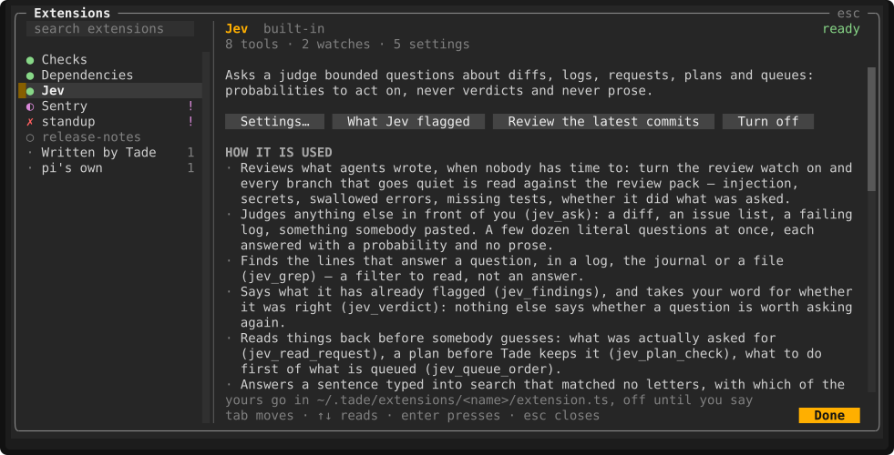

---

## Sentry, both ways

Point the Sentry extension at your organisation and *"fix new Sentry errors as they come"* becomes a
watch: each new issue is an agent with the stack trace, the trace and the logs already in its
context. Point Tade's own telemetry at a Sentry project of yours and it reports **itself** the same
way — so Tade can be handed its own bug.

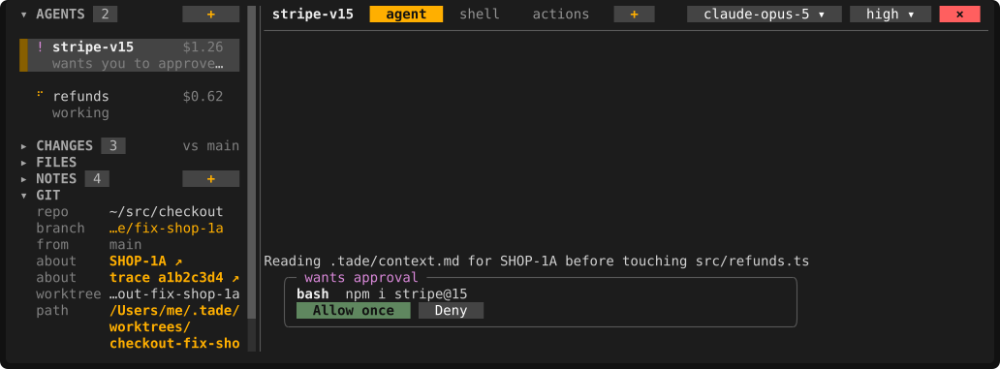

---

## Models and harnesses

Pick what the orchestrator runs on, and what every new agent starts on — every model you are signed
in to, priced per million tokens, filtered as you type — and how hard it should think. Providers
come from the harness you are signed in to; harnesses come from one registry, pi today and others as
adapters.

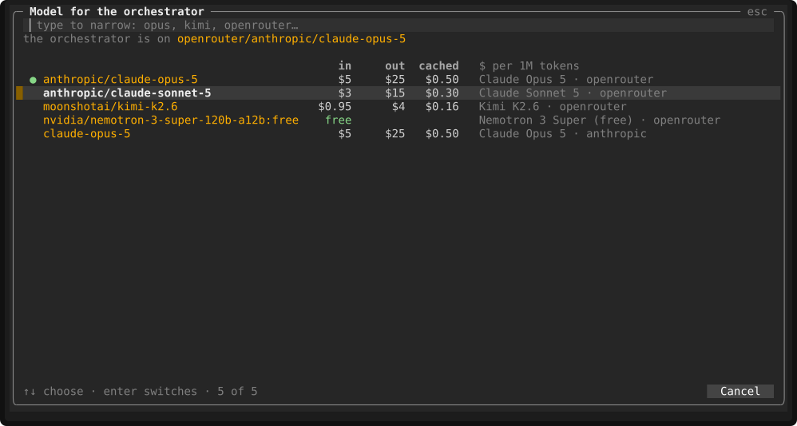

---

## Keys

Every key Tade keeps, on `F1`, and every one of them changeable in Settings. Everything else goes
straight to the agent or terminal you are typing at.

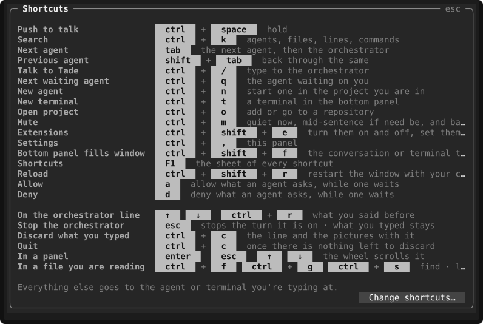

---

## The brief, and where everything stands

One paragraph of what is stopped, what is moving and what the extensions found — in the window, by
voice, or as `tade brief` from any shell. Nothing in it is remembered: `tade status` derives every
task again from git, processes and transcripts, and answers while the window is open.

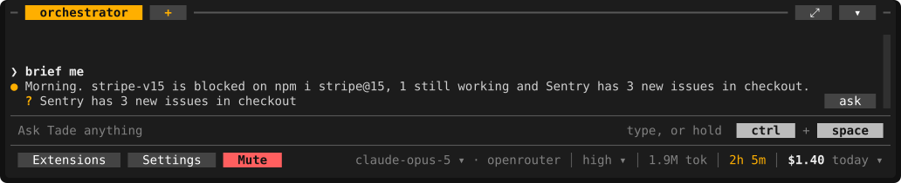

---

## Approvals, on your terms

Off by default, and every command an agent runs is classified and written down either way. Turn
`approvals.mode: policy` on and the risky ones stop and ask — in the window, by voice, or from
another project's toast. Agents can be boxed in with `seatbelt` or `bwrap`; a sandbox that cannot be
applied fails the run rather than quietly running without one.

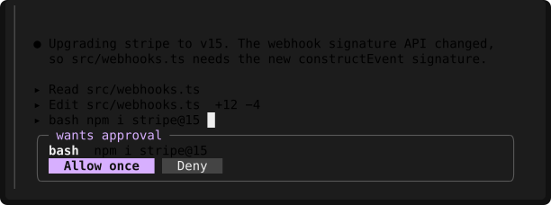

---

## Planned

Named here so nothing above has to hint at it — these are not built:

- **The rest of the forge** — GitLab and the other forges against the same port, merge queues,
  stacked reviews, and running a workflow in its own container (`act`) rather than the commands it
  runs. GitHub, the review loop and local actions are built (see **The checks** and **Reviews**
  above); the port they are built against is neutral, which is what leaves room for the rest
  (`packages/forges/core`).
- **The rest of the judge** — asking a question in `ctrl+k` instead of matching one, watching agent
  turns for an agent going in circles, and catching a destructive command the approval rules do not
  name. The judge, its tools, the review watch and the onboarding step are built (see **Jev** under
  Extensions); these three are deliberately not, and a judge may only ever add caution
  (`packages/judges/core`).
- **More harnesses** — Claude Code and Codex are named in the harness registry and not supported
  yet.

---

## Install

**Requirements**

- Node ≥ 22.19 and pnpm 10 — Tade runs TypeScript directly, so there is no build
- git
- optional: tmux (agents that outlive the window), whisper.cpp and ffmpeg (speech), `gh` (PR state)

```sh
git clone <this repository> tade && cd tade
pnpm install
pnpm run link:global    # puts `tade` on your PATH, from any directory
```

The link points straight at this checkout: `tade` always runs the code you have, and `git pull` is
the upgrade. Check it with `which tade` and `tade --version`; undo it with `pnpm run unlink:global`.
If `tade` is not found afterwards, the global bin directory is not on your `PATH` — `pnpm bin -g`
prints it, and `pnpm setup` adds it to your shell profile.

### First run

```sh
tade              # the window; the first time, a short setup
```

The setup asks for a project, a model, where agents should run and whether you want speech. It
writes `~/.tade/config.yaml`, which **Settings** (`ctrl+,`) edits afterwards — every setting with
what it means beside it, and what needs a restart marked.

<table>
<tr>
<td width="50%">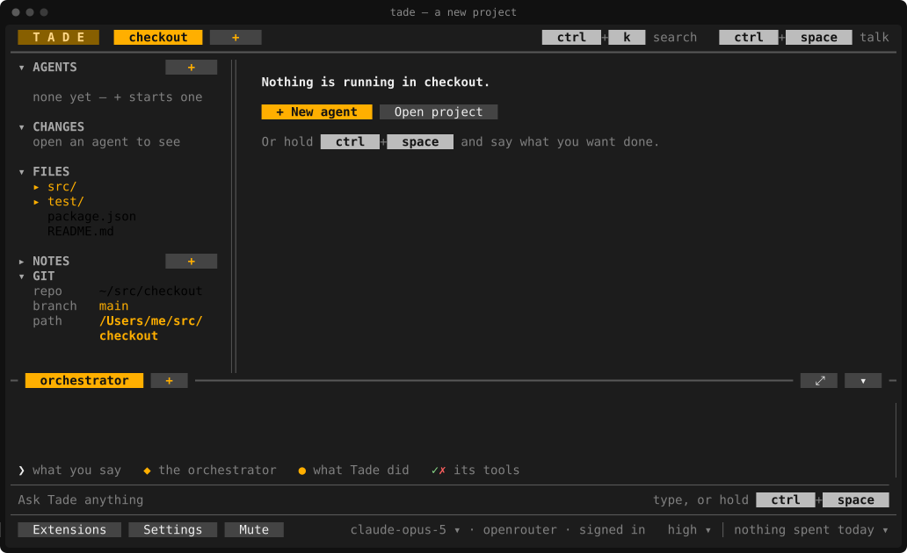</td>
<td width="50%">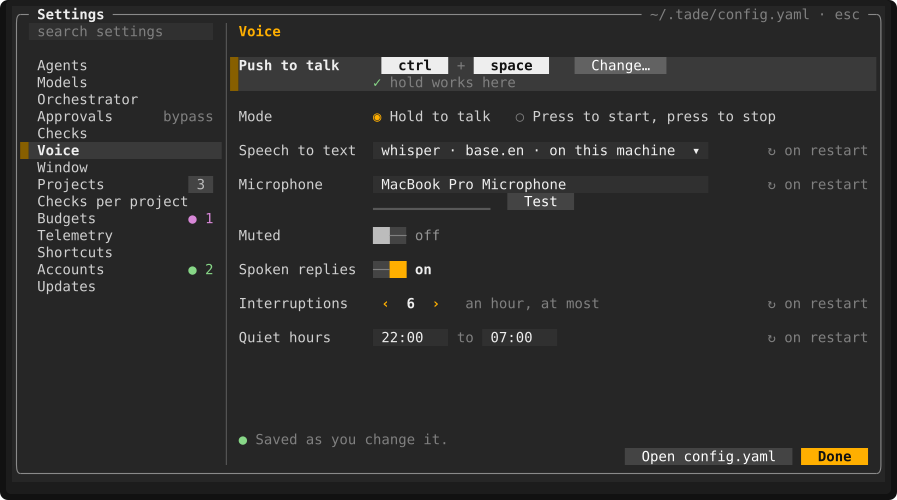</td>
</tr>
</table>

### Keys to start with

`ctrl+space` talk · `ctrl+k` search · `tab` next agent · `ctrl+n` new agent · `ctrl+t` terminal ·
`ctrl+/` orchestrator · `ctrl+m` mute · `F1` every key

Keys with shift, and ctrl with a digit or `m`, need a terminal that speaks the Kitty keyboard
protocol (Ghostty, kitty, WezTerm, iTerm2).

### From any shell

```sh
tade brief        # everything that matters, in one paragraph
tade status       # every task, derived fresh from git and processes
tade spend        # what the agents cost, and how long they ran
tade notes        # what you have told Tade, newest first
tade schedules    # what runs on a clock, and when it runs next
tade extensions   # what is loaded, what it needs, and what is off
tade --help       # everything else
```

These read the files directly, so they answer while the window is open.

### Settings worth knowing

```yaml
agents:
  workspace: checkout        # or `worktree`: a worktree and branch per agent
  commit: own-files          # when agents commit, and what: when-done · as-you-go · never
  instructions: |            # anything else every agent should be told
    Conventional commits, please.
workspace:
  driver: pty                # or `tmux`, for agents that outlive the window
approvals:
  mode: bypass               # or `policy`: risky commands ask first
projects:
  checkout:
    root: ~/src/checkout
    max_parallel: 3          # at most three agents at once here
    test_command: pnpm test  # what `tade check` runs
    budget: { usd_per_day: 5 }
```

### Extensions

- **Dependencies** checks npm, pnpm catalogs, PyPI, crates.io and Go modules for what is behind,
  vulnerable or deprecated, and hands the updates to an agent: *"verify and update all the
  dependencies in checkout"*. Its **Vulnerable dependencies** watch looks daily.
- **Sentry** reads issues, traces, logs, spans and metrics, and starts agents on fixes with
  everything Sentry knows in their context. It uses your sentry-cli credentials; name the
  organisation:

  ```yaml
  extensions:
    sentry:
      org: acme
      projects: { checkout: checkout-api }   # when a Sentry slug differs from the project name
  ```

- **Jev** asks a small, fast judge bounded questions about the things nobody has time to read — a
  diff, a thousand log lines, a request before it becomes a plan, a queue that needs an order — and
  answers with a probability and no paragraph. Its **Review what agents change** watch reads a
  branch when it stops moving and reports what it flags, for a person or an agent to read. It
  never approves, merges or closes anything. It needs a key and does nothing without one:

  ```sh
  export TYPESAFE_API_KEY="…"        # from console.typesafe.ai/settings/keys
  ```

  ```yaml
  extensions:
    jev:
      model: jev-1.13.0     # pin a version, never an alias: thresholds are tuned against one
      projects: [checkout]  # nothing is sent from a project not named here
  ```

- **Resources** keeps what Tade and everything it runs is using in the status bar.

Turn them on and off, set them up, and read what Tade wrote for itself from **Extensions**
(`ctrl+shift+e`) — `tade setup` asks which ones to use, and one you turn on loads the next time Tade
starts. `tade --safe` starts with none of yours loaded, however they are set.

### Tade's own trouble

Tade can report itself to a Sentry project of yours through Sentry's own SDK: crashes and the
warnings it writes down as issues, what happened around them as logs, and every agent turn as a
trace — `gen_ai` spans with the model, the tools it called and what it cost. Nothing is sent until
you say where, and what is sent is the shape of what happened — never your code, what you said, or
what an agent wrote.

```yaml
telemetry:
  dsn: https://…@…ingest.sentry.io/…   # from that project's Client Keys; empty sends nothing
  environment: laptop                   # which Tade this is
  agents: true                          # time turns, tools and tokens (on)
  traces: 0.1                           # how much of Tade's own work is timed
```

`$TADE_TELEMETRY_DSN` does the same without putting it in a file, and **Settings › Telemetry** has
all of it — every switch above, with what it sends written beside it, and which Sentry the
extension reads back. Point Tade's own repository and a Sentry watch at it and it fixes itself:

```yaml
projects:
  tade: { root: ~/src/tade }
extensions:
  sentry:
    projects: { tade: your-tade-sentry-project }
```

---

## How it works

```
        you ──speak or type──▶  orchestrator  ──plans──▶  smart queue
                                     │                        │
                                     │ starts, steers, stops  │ starts when what it
                                     ▼                        ▼ waits on has finished
   ┌──────────────────────── agents, one lane each ────────────────────────┐
   │  pi in your checkout on its branch · or a git worktree of its own     │
   └───────────────────────────────────┬───────────────────────────────────┘
                                       │
        tmux or the window owns the processes · pi owns the conversations
                        git owns the work · you own the notes
                                       │
                                       ▼
                    status is read back from all of them, fresh
```

Tade keeps no state of its own, so closing it loses nothing. Under `tmux` the agents keep working
without you; either way every conversation is a pi session that picks up exactly where it left off,
an agent that was running when you closed is opened again where it was, and what is true now is
asked again rather than remembered. Everything Tade writes for itself — an extension, a lesson — is
inert until a person approves it, and is committed as `Tade`, so you can see it and undo it.

---

## Development

```sh
pnpm check                 # lint, types and tests: the full gate
pnpm tade                  # run the CLI from source, without linking it
pnpm screens               # a page of every screen the window must keep looking like
pnpm screens --assets      # redraw images/ from those same screens
```

Every picture in this README is drawn from the scenarios the golden screen tests protect — change
how the window looks, run `pnpm screens --assets`, and the page shows the new one.

[AGENTS.md](AGENTS.md) is the guide for anyone — or any agent — changing Tade, and
[.claude/skills](.claude/skills) holds recipes for the changes that recur.

## License

MIT — see [LICENSE](LICENSE). Tade builds on the work of many others; they are credited, with their
licences, in [THIRD_PARTY_NOTICES.md](THIRD_PARTY_NOTICES.md).
