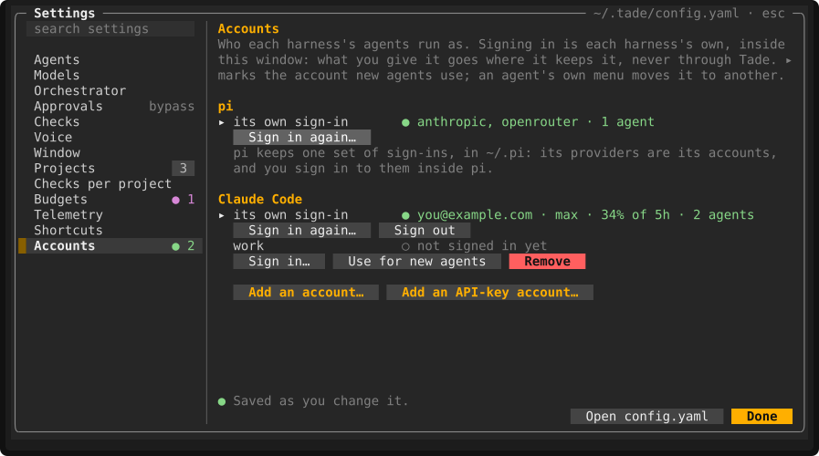

# Tade — **T**erminal **A**gentic **D**evelopment **E**nvironment

### Say what you want done. Watch a team of coding agents do it — in one terminal window.

Tade is an IDE for the agents doing the work: an orchestrator you talk to, agents in your own
repositories, a queue that knows what waits for what, and every file, diff, terminal and dollar in
front of you while it happens.

```sh
git clone <this repository> tade && cd tade
pnpm install
pnpm run link:global    # puts `tade` on your PATH
tade                    # the window; the first time, a short setup
```

Needs Node ≥ 22.19, pnpm 10 and git — there is no build step, so `tade` always runs the code you
have and `git pull` is the upgrade. Optional: tmux (agents that outlive the window), whisper.cpp and
ffmpeg (speech), `gh` (pull request state).


## The window

Agents down the left with what each has cost, their changes, the files, the agent you are watching
in the middle, the orchestrator along the bottom. One terminal, no browser, no daemon.


## An orchestrator you talk to

Say or type what you want. It starts, steers and stops agents, opens terminals, and shows every tool
as it runs — including the ones that fail, with the reason. Drop a screenshot on the window and it
goes with whatever you say next.


## Voice, first

Hold `ctrl+space` and talk. Speech stays on your machine by default, answers come back as a few
spoken sentences with the rest on screen, and mute cuts the sentence being said, not the next one.


## Agents, together or apart

Every agent gets a lane of its own. By default they all work in the project's checkout; one setting
gives each a worktree and branch instead. What each one *is* — working, idle, waiting on you,
failed, finished — is read back from git and the processes, never remembered.

<table>
<tr>
<td width="34%"></td>
<td width="66%"></td>
</tr>
</table>

## Smart queues

Ask for five things at once. What can run now runs; the rest waits for exactly what it needs and
starts by itself. Click a piece of queued work and you see the whole chain, why each link waits, and
what its agent will be told — looking is never starting.


When something upstream fails, the work it feeds is **held**, not lost — and Tade says so and asks.


## Scheduled tasks

"Every Monday morning, update our dependencies." It becomes a schedule: a rule, an instruction and a
record of every run. There is no daemon — what came due while Tade was closed is caught up when it
opens, or skipped, as the schedule says.


## Watches

A watch is a schedule that looks before it acts: a cheap check, and an agent on each new finding.
Extensions offer them; nothing is watched until you turn one on.


## An IDE in the terminal

The repository is right there while the agents work it: the file tree, the diffs, the branch, a
terminal in the same worktree — and a file you can open where you are, typed into and saved, or
handed to the editor you actually use.


## Context-rich search

`ctrl+k` finds agents, files in every worktree, the lines inside them and the things Tade can do —
each result saying which project and which agent it belongs to. `file:42` goes straight to a line.


## Changes, tracked as they happen

Every file an agent touches, marked the way git marks it, with the diff a click away.

<table>
<tr>
<td width="30%"></td>
<td width="70%"></td>
</tr>
</table>

## The checks, before anybody else sees them

A project says what it checks in one file, and that same file is what CI is generated from. Tade
runs them here, one set at a time per checkout, and records each against the commit it ran on. A
push with nothing green behind it is held, with what is missing.


## Reviews, and the loop around them

What you have offered other people, and what they and their robots say about it: your open pull
requests, what waits on you, what CI makes of each, and the conversations nobody has answered.
Watches can fix what is red and answer the bots — and nothing merges anything unless you asked for
exactly that.


## Spend, time and tokens

What every agent and the orchestrator cost today, this window or this week — tokens, runtime and
dollars, each project against the budget you gave it.


## Resources

Tade has to be light, and proves it: what it and everything it runs is using, in the status bar and
broken down by project, by kind and by agent.


## Local memory and notes

Notes are the one thing Tade is told rather than derives, so they are kept word for word, in a file
you own. Say *"remember the staging key rotates on the 1st"*, or press `+`. Agents are given the
notes that concern their work.


## Many projects, many tasks

Projects along the top, agents running in all of them at once. An agent in a project you are not
looking at can still reach you — and be answered from where you are.


## Extensions

Checks, Dependencies, Jev, Reviews, Sentry and Resources ship with Tade; yours go beside them in
`~/.tade/extensions/`. An extension brings tools the orchestrator and your agents can both call,
settings and watches. Being there is not being on: one of yours is listed and off until you turn it
on. Keys are pasted in and kept in your keychain, never in a file you might commit.


## Sentry, both ways

Point the Sentry extension at your organisation and *"fix new Sentry errors as they come"* becomes a
watch: each new issue is an agent with the stack trace, the trace and the logs already in its
context. Point Tade's own telemetry at a Sentry project of yours and it reports **itself** the same
way — its crashes and its own warnings, never your code or what you said — so Tade can be handed its
own bug.


## Models and harnesses

Pick what the orchestrator runs on and what every new agent starts on — every model you are signed
in to, priced per million tokens — and how hard it should think.


Agents run in **pi** or in **Claude Code**, side by side, one harness per agent, moved from one to
the other from its menu. Claude Code signs in as itself — Tade never sees it — and can run as more
than one account at once; an agent that runs out moves to another, its conversation with it.



## Shortcuts and settings

`ctrl+space` talk · `ctrl+k` search · `tab` next agent · `ctrl+n` new agent · `ctrl+t` terminal ·
`ctrl+/` orchestrator · `ctrl+m` mute · `F1` every shortcut · `ctrl+,` settings

Everything else goes straight to the agent or terminal you are typing at. Every key is changeable,
and every setting has what it means beside it.

<table>
<tr>
<td width="50%"></td>
<td width="50%"></td>
</tr>
</table>

## The brief, and where everything stands

One paragraph of what is stopped, what is moving and what the extensions found — in the window, by
voice, or as `tade brief` from any shell. Nothing in it is remembered: every task is derived again
from git, processes and transcripts.


## Approvals, on your terms

Off by default, and every command an agent runs is written down either way. Turn approvals on and
the risky ones stop and ask — in the window, by voice, or from another project's toast. Agents can
be boxed into a sandbox; one that cannot be applied fails the run rather than quietly running
without it.


## License

MIT — see [LICENSE](LICENSE). Tade builds on the work of many others; they are credited, with their
licences, in [THIRD_PARTY_NOTICES.md](THIRD_PARTY_NOTICES.md). Changing Tade itself starts at
[AGENTS.md](AGENTS.md).
